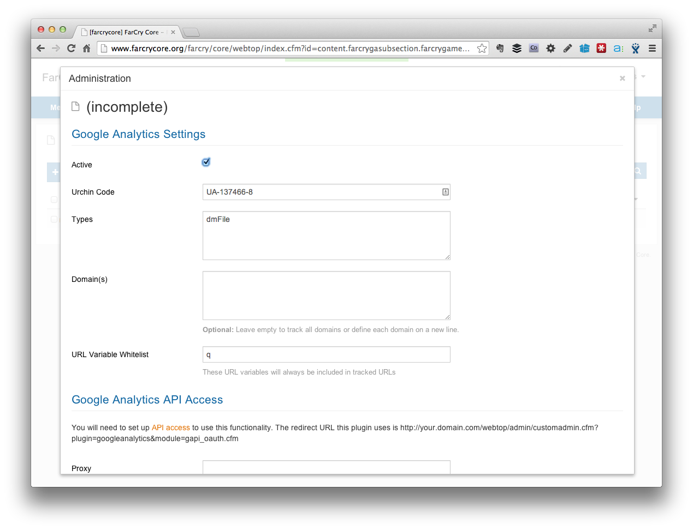
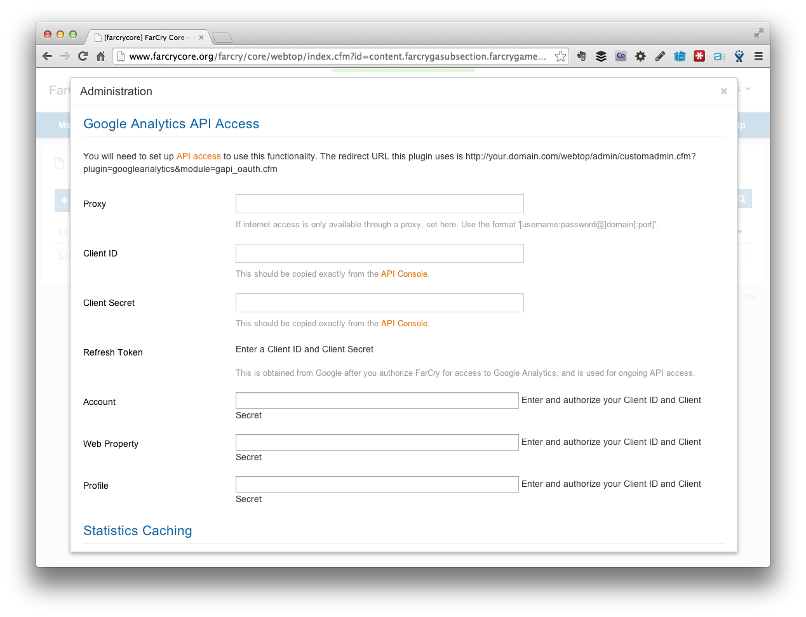

# Google Analytics Plugin

A must have plugin providing close integration for FarCry projects with the Google Analytics service v3.0 API

> Certified for versions of FarCry 6.0.15+

Front End Features include:

- management of urchin tracking integration for your site
- automatic tracking for external links
- automatic tracking for file downloads through `download.cfm`

Back end features (requires Google API authentication):

- webtop overview integration
- stats for individual pages or content items
- stats for site tree branches or sections
- inline line charts and dot graphs for 7, 30, 90 and 356 day periods
- support for downloads and external link reporting
- a framework for tracking Google custom variables
- popular content publishing rule

## Screenshots


## Installation

> TRUNK should be mostly stable. But there are specific milestone tags for those who don't want to risk it. 

Clone code base to `./farcry/plugins/googleAnalytics`

Copy the "www" folder to a "googleanalytics" folder under your project's webroot or create a web server alias (virtual directory on IIS) as "/googleanalytics" pointed at the plugin's www folder. There are some JS libraries that need to be referenced.

Add googleAnalytics to the plugin list within `./mywebapp/www/farcryConstructor.cfm`

```
<cfset THIS.plugins = "farcrycms,googleMaps,googleAnalytics,farcrydoc" />
```

Deploy the plugin's content types: 

- go into the webtop **ADMIN > DEVELOPER TOOLS >COAPI** and deploy all the plugin content types, and; 
- restart the application (eg. from the URL ?updateapp=projectkey or the webtop)

### Settings

Settings are configured under **CONTENT > Google Analytics**.  All you need to add is your Google Analytics Urchin code.  The rest of the settings are optional.




### Set Up Google API Profile (optional)

If you want to show statistics directly within the webtop, you will need to set up access for the webapp to access your web stats through the Google API.

Set up a project in your Google API console

- under Services, enabled Analytics API
- under API Access, create a client ID (the redirect URI must be http://your.domain.com/webtop/admin/customadmin.cfm?plugin=googleanalytics&module=gapi_oauth.cfm)
- In FarCry, create/edit your settings in Content -> Google Analytics -> Site Settings
- Copy in the clientID and secret
- Authorise FarCry to access the your analytics data (there should be a link next to Refresh Token)
- Select your Account, Property, and Profile.



## What else?
That's literally it. If GA Plugin detects that you are serving a page from one of the configured domains, it will automatically include the correct urchin code for your domain in the HEAD of your document.
